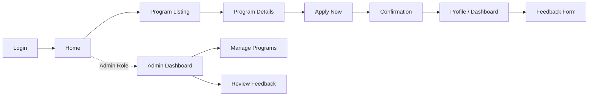
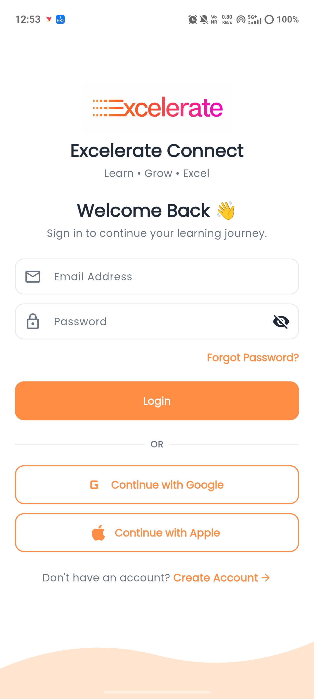
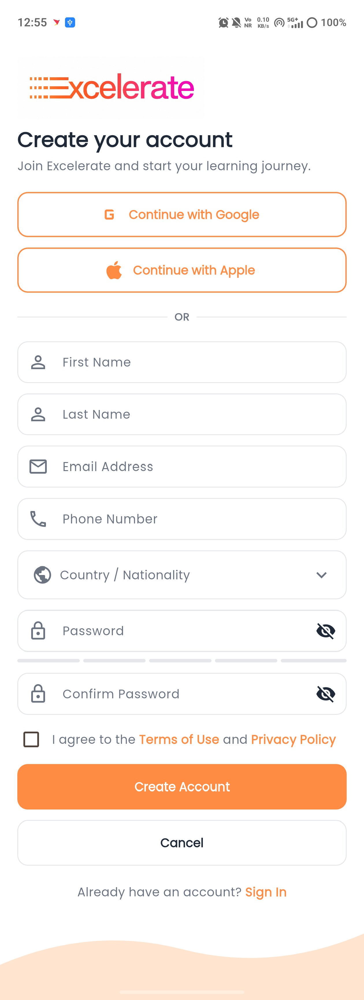

<div align="center">

# Excelerate Connect

**A mobile companion app for the Excelerate learning & internship ecosystem**


</div>

---

## Overview

Excelerate Connect brings Excelerate's virtual internship and learning-program ecosystem into a single, easy-to-use mobile experience. Learners can discover, apply for, and track global internships, courses, and competitions, while administrators get a lightweight way to publish and manage program content and monitor learner engagement.

## Project Vision

Excelerate Connect aims to make discovering and completing virtual internships and learning programs as simple as browsing a marketplace — helping learners build real career experience and giving administrators an efficient way to publish and manage opportunities, all from a mobile device.

## Objectives

- Build a cross-platform (iOS/Android) Flutter application for the Excelerate learner and admin experience
- Deliver a clean, low-friction application flow from discovery to enrollment
- Establish a modular codebase (screens / widgets / models / services) that scales cleanly as features are added

## Navigation Flow



A persistent bottom navigation bar (**Home · Programs · Alerts · Profile**) is available on every screen once a learner is logged in — no dead ends in the flow.

## Tech Stack

| Layer | Tool |
|---|---|
| Framework | Flutter & Dart |
| Design | Figma (wireframes & UI) |
| Version Control | Git & GitHub |

## Project Structure

```
excelerate_connect/
├── lib/
│   ├── screens/       # UI screens (Login, Home, Program Listing, etc.)
│   ├── widgets/        # Reusable UI components
│   ├── models/         # Data models
│   └── services/       # API / data handling
├── android/             # Android platform files
├── ios/                 # iOS platform files
├── pubspec.yaml         # Dependencies & project metadata
└── README.md
```

## Current Progress

- [x] App Proposal & Target Users defined
- [x] Low-fidelity Wireframes (Login, Home, Program Listing, Program Details/Profile)
- [x] GitHub Repository Setup
- [x] Core Screens built in Flutter (Week 2)
- [ ] Feature Integration (data, navigation logic) (Week 3)
- [ ] Testing & Polish (Week 4)

## Week 2 Deliverables

- **Demo Video Walkthrough:** [Watch Video](https://drive.google.com/file/d/1ACBNF87p2x0uwsUSbDn7LqQr8Rq95C_w/view?usp=drivesdk)
- **Implemented Screens:** Login, Sign-Up, Home, Program Listing, Program Details — all five fully built and wired together end-to-end.
- **Screen Ownership:**
  | Screen | Built by |
  |---|---|
  | Login & Sign-Up | Bhavyasree |
  | Home | Hari |
  | Program Listing | Suraj |
  | Program Details | Victor |
  | Navigation wiring, bug fixes & full UI/UX overhaul across every screen | Krrish (Team Lead) |
- **Design Choices:** Consistent Excelerate branding (Poppins typography, `#FF8C42` primary orange), scalable modular architecture (screens / widgets / theme separated), seamless navigation via named routes, custom frosted-glass bottom nav bar with a curved silhouette, and a unified premium visual language applied across all five screens during the UI/UX pass.

### Screenshots

<table>
  <tr>
    <td align="center"><br/><b>Login</b></td>
    <td align="center"><br/><b>Sign Up</b></td>
    <td align="center"><br/><b>Home</b></td>
  </tr>
  <tr>
    <td align="center"><br/><b>Program Listing</b></td>
    <td align="center"><br/><b>Program Details</b></td>
    <td></td>
  </tr>
</table>
