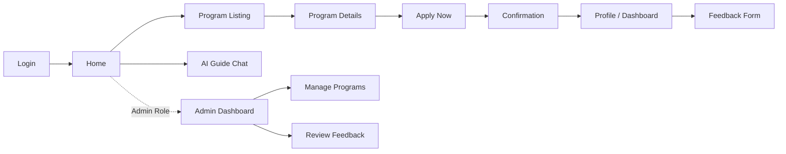
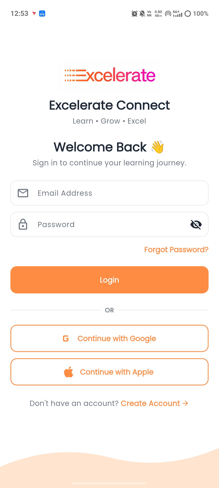
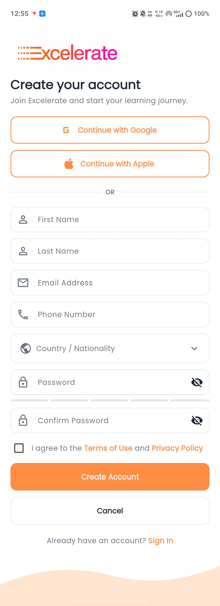

<div align="center">

# Excelerate Connect

**A mobile companion app for the Excelerate learning & internship ecosystem**


</div>

---

## Overview

Excelerate Connect is a platform that facilitates program exploration for learners and simplifies announcement sharing and feedback collection for admins. Learners can discover, apply for, and track global internships, courses, and competitions from a single mobile app; admins get a lightweight way to publish and manage program content and monitor learner engagement.

## Key Features

- **Program discovery** — a scrollable, filterable catalog (Program Listing) and a rich Program Details view for every internship, course, and competition, both backed by an async data layer with real loading, error+retry, and pull-to-refresh states.
- **Full learner flow** — Login, Sign-Up, a personalized Home dashboard, Program Details, Registration, and a Feedback form, all wired together with consistent branding and validation.
- **App-wide Light/Dark theme** — a single toggle in the Home header (between the notification bell and the profile avatar) switches the entire app's colors with an animated cross-fade. The choice is remembered across launches and follows the device's own theme the first time the app runs. Login and Sign-Up are the one deliberate exception — they always render in light mode, matching how most apps treat their auth screens.
- **AI Guide chatbot** — a full-screen assistant (accessible from every screen) that answers learner questions about the app's programs from a local, offline knowledge base — deep coverage of the Flutter Mobile App Development internship (this project itself) and lighter coverage of Excelerate's other programs. No network call and no ML model are involved yet; see **Roadmap** below for where this is headed.
- **Branded loading & error states** — a custom animated loading mark and a single reusable `ErrorRetryCard` replace generic spinners and one-off error UIs across every screen.

### Roadmap: AI Guide → a real LLM assistant

The AI Guide is intentionally built as a simple, fast, offline keyword-matched chatbot today — no ML, no network call — so it never has a blank answer and works with zero setup. The planned next step is to grow it into a genuine LLM-backed assistant wired to a RAG (retrieval-augmented generation) pipeline over the *entire* LMS course library, not just this internship. The goal: a learner who's lost on their track — say, unsure what Week 3 of their program actually requires, or who missed a sync meeting — can just ask the AI Guide and get a real, personalized answer, drawn from the actual course content, with concrete next steps for their own plan. It should also be able to answer general "what is Excelerate / what do they offer / what's new" questions well enough to make a prospective learner want to join. This is a deliberate next-phase goal, not yet implemented.

## Navigation Flow


```mermaid
flowchart LR
    A[Login] --> B[Home]
    B --> C[Program Listing]
    C --> D[Program Details]
    D --> E[Apply Now]
    E --> F[Confirmation]
    F --> G[Profile / Dashboard]
    G --> H[Feedback Form]
    B --> I[AI Guide Chat]

    B -.Admin Role.-> J[Admin Dashboard]
    J --> K[Manage Programs]
    J --> L[Review Feedback]
```

A persistent bottom navigation bar (**Home · Programs · Alerts · Profile**) and a floating AI Guide entry point are available on every screen once a learner is logged in — no dead ends in the flow.

## Tech Stack

| Layer | Tool |
|---|---|
| Framework | Flutter & Dart |
| Fonts | Google Fonts (Poppins) |
| Local persistence | `shared_preferences` (theme preference) |
| Images / media | `cached_network_image`, `flutter_svg`, `lottie` |
| Design | Figma (wireframes & UI) |
| Version Control | Git & GitHub |

## Project Structure

```
excelerate_connect/
├── lib/
│   ├── screens/         # Login, Sign-Up, Home, Program Listing/Details,
│   │                     Feedback, Registration, AI Chat
│   ├── widgets/          # Reusable UI components (nav bar, cards, theme toggle, ...)
│   ├── core/
│   │   ├── theme/        # AppTheme, AppPalette (light/dark tokens), ThemeController
│   │   └── routes/        # Named-route navigation
│   ├── data/              # Mock data & the AI Guide's local knowledge base
│   └── services/          # Async data + chat services
├── android/              # Android platform files
├── ios/                   # iOS platform files
├── pubspec.yaml           # Dependencies & project metadata
└── README.md
```

## Screenshots

<table>
  <tr>
    <td align="center"><br/><b>Login</b></td>
    <td align="center"><br/><b>Sign Up</b></td>
    <td align="center"><br/><b>Home</b></td>
  </tr>
  <tr>
    <td align="center"><br/><b>Program Listing</b></td>
    <td align="center"><br/><b>Program Details</b></td>
    <td></td>
  </tr>
</table>

## Getting Started

**Prerequisites:** Flutter SDK (3.x+) and Dart, a configured Android/iOS toolchain (Android Studio and/or Xcode), and a connected device or emulator.

```bash
git clone https://github.com/KrishTrivedi025/excelerate_connect.git
cd excelerate_connect
flutter pub get
flutter run
```

## Demo Video

_Link to be added once recorded._

## Contributors

| Area | Contributor |
|---|---|
| Login & Sign-Up, Feedback form | Bhavyasree |
| Home screen, Registration form | Hari |
| Async data layer (`OpportunityService`), `ErrorRetryCard` | Suraj |
| Program Listing & Details, async wiring | Victor |
| Team Lead — navigation, full UI/UX pass, app-wide Light/Dark theme system, AI Guide chatbot, documentation | Krish |

## Changelog

- Core screens (Login, Sign-Up, Home, Program Listing, Program Details) built and wired end-to-end with consistent Excelerate branding.
- Async data layer added to Program Listing and Program Details — real loading, error+retry, and pull-to-refresh instead of static data.
- Feedback and Registration forms built with full validation and a branded submit → success flow.
- Branded loading indicator rolled out across every loading state.
- App-wide Light/Dark theme system added — a `ThemeExtension`-based palette, a header toggle with an animated icon morph, and persistence via `shared_preferences`.
- AI Guide chatbot added — a full-screen assistant with a local knowledge base, reachable from every screen.
